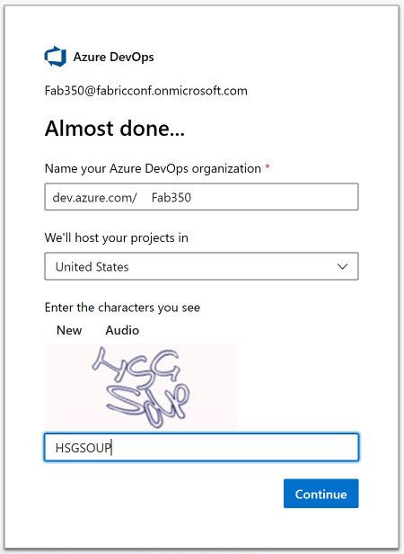
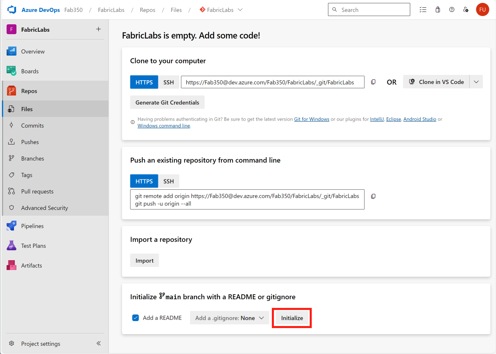
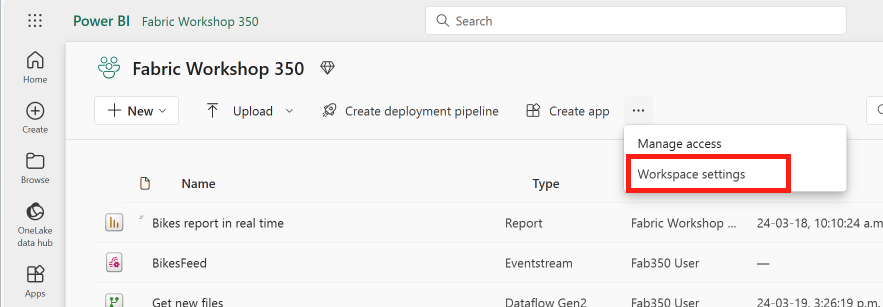
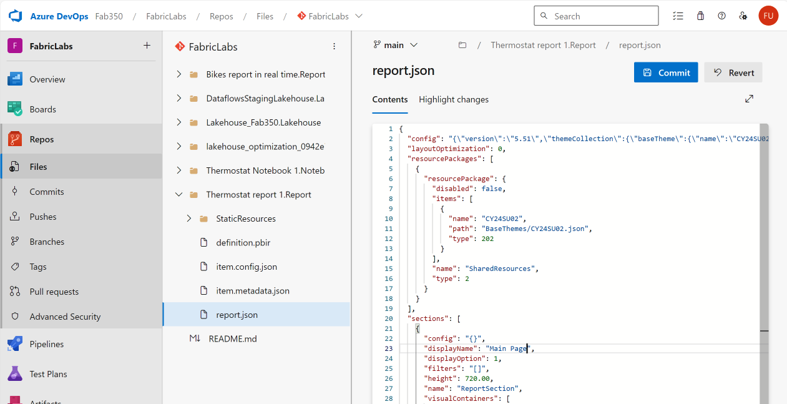
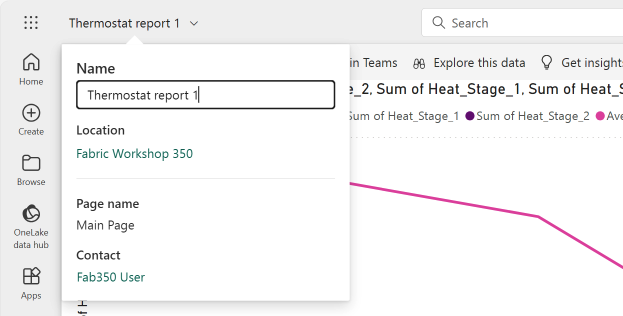
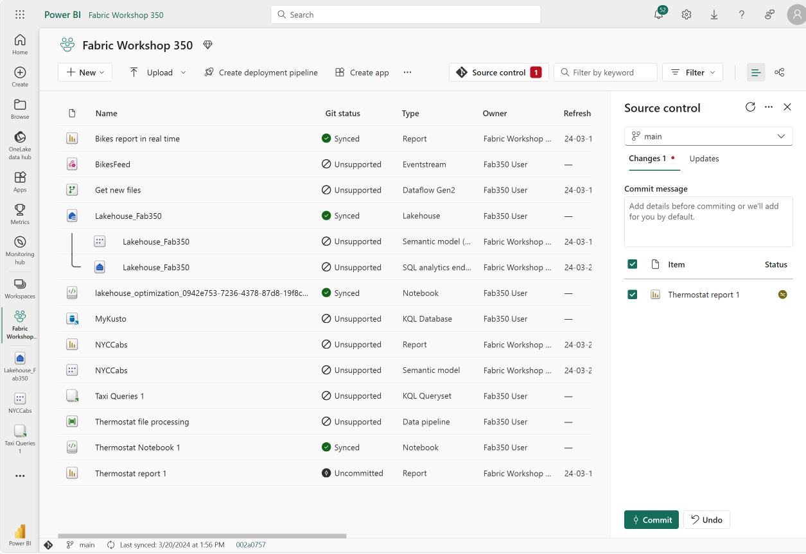
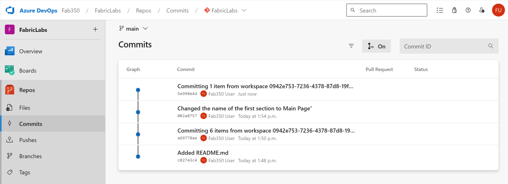

# Source control with DevOps or Github

Fabric allows you to bind a workspace to a repository in Azure DevOp or Github. In this lab, we will set up version control for our workspace.

## Set up the DevOps service

Navigate to [https://aex.dev.azure.com](https://aex.dev.azure.com/) Create a new DevOps org at dev.azure.com. Sign in with your tutorial account. Select "Continue" on the "more details" page. Next, click the "Create new organization" button. Accept the defaults, change the hosting location to "United States", enter the Captcha code, and click "Continue".

Create a new project named "FabricLabs". Leave it as "Private".

Once the project is created, select the "Repos" node. In the bottom section, click the "Initialize" button to create this new repo.

## Connect the Fabric workspace to the repo

Navigate to the "Fabric Workshop xxx" workspace.

In the ribbon, select the ellipsis, and then select "Workspace settings".

Select the "Git integration" node.

Click on the "Azure DevOps" tile for the Git provider and select your userid for the AAD account. Using the dropdowns, select the organization, project and repo created above. Select the "main" branch. Click the "Connect and sync" button.

Note that a new column is added to the workspace, "Git status". After a moment, the values in the "Git status" column will be updated. Note that some items are unsupported - this will change over time.

## Deploy Devops changes to the workspace

Navigate back to your Devops repo. Refresh the windows to see the changes.

Open the Thermostat report 1.Report node, and select the report.json file.

Click the "Edit" button in the upper right corner.

Scroll down to line 23, "displayName". Change the value ""Page 1" to "Main Page".

Click the "Commit" button.

Enter a comment, then click the "Commit" button.

Navigate back to the Fabric workspace, and click the "Source control" button in the ribbon. Note that it shows an unsynced item.

Click the "Update all" button. This syncs the changes from DevOps.

Open the "Thermostat report 1" report. Select the name dropdown in the upper left corner of the screen, and note that the name of the currently open page is now "Main Page".

## Sync workspace changes with DevOps

Click the "Edit" button to put the report into edit mode.

Double click on the "Main Page" tab at the bottom.

Change the name to "My Page" and save the report.

Navigate back to the workspace. Note that the Git status beside the report name shows "Uncommitted".

Click the Source control button. Select the change, enter a commit message (tempting to skip, but it's always a good practice), and click the "Commit" button.

Navigate back to Devops, and open the report.json file again.

Note that the value of displayName has changed to "My Page".

Click on the "Commits" node, on the left and note the history.

